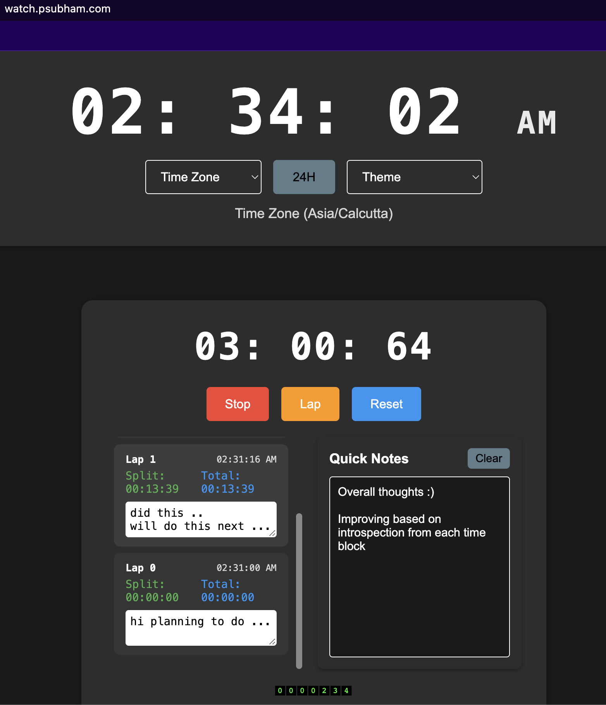

# Digital Stopwatch

This project is a digital stopwatch application with various features including lap timing and theme switching.

## Project Structure
stopwatch/ 
├── .vscode/ │ 
             └── settings.json 
├── index.html 
└── static/ 
        ├── script.js 
        └── style.css

- `index.html`: The main HTML file that serves as the entry point for the web application.
- `static/script.js`: The JavaScript file that contains the logic for the stopwatch application.
- `static/style.css`: The CSS file that contains styles for the stopwatch application.

## Features

- **Start/Stop**: Start and stop the stopwatch.
- **Lap Timing**: Record lap times.
- **Reset**: Reset the stopwatch.
- **Theme Switching**: Switch between light and dark themes.
- **Time Zone Selection**: Display the time in different time zones.
- **24H/12H Format**: Toggle between 24-hour and 12-hour formats.
- **Notes**: Add quick notes related to the stopwatch.

## How to Run

1. Clone the repository:
    ```sh
    git clone https://github.com/yourusername/stopwatch.git
    ```

2. Navigate to the project directory:
    ```sh
    cd stopwatch
    ```

3. Open [index.html](http://_vscodecontentref_/4) in your web browser to run the application.

## Usage

- **Start/Stop**: Click the "Start" button to start the stopwatch. Click the "Stop" button to stop it.
- **Lap Timing**: Click the "Lap" button to record a lap time.
- **Reset**: Click the "Reset" button to reset the stopwatch.
- **Theme Switching**: Click the theme toggle button to switch between light and dark themes.
- **Time Zone Selection**: Use the dropdown to select a time zone.
- **24H/12H Format**: Click the "24H" button to toggle between 24-hour and 12-hour formats.
- **Notes**: Type your notes in the notes area. Click the "Clear" button to clear the notes.

## ScreenShots
